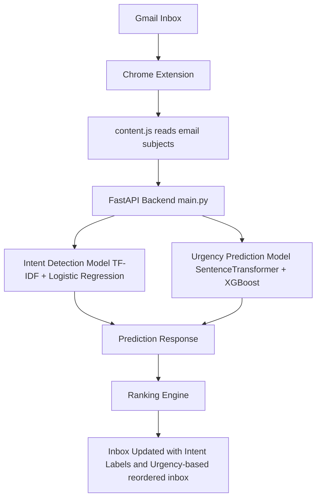
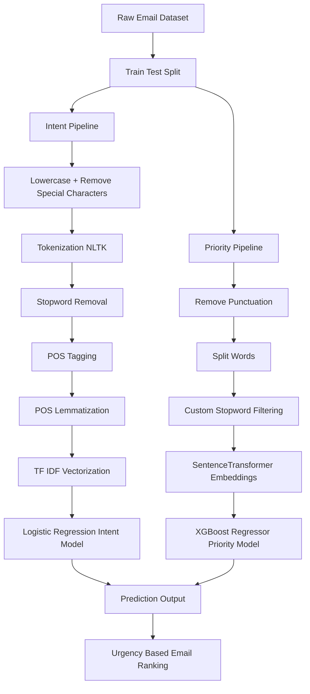

<h1 align="center">
Gmail Intelligent Academic Email Ranking Extension
</h1>
<p align="center">
<b>Author:</b> Aashi Tiwari
</p>
<br>
</br>
<p align="center">
AI-powered system that <b>detects the intent of academic emails</b> and <b>dynamically ranks them by urgency directly inside Gmail</b>.
</p>

<p align="center">


</p>

<p align="center">


</p>
<br>
</br>

<p align="center">
Instead of simply categorizing emails like traditional inbox filters, this system <b>reorders emails based on predicted urgency</b>, helping users immediately see the most critical messages.
</p>
<br>
</br>

---

## Problem


Traditional inboxes sort emails **by time**, not importance.

| System | Behavior |
|---|---|
| Gmail Tabs | Categorizes emails |
| Filters | Moves emails to folders |
| Priority Inbox | Marks important emails |

None **reorder the inbox dynamically by urgency**.

---

## Key Idea

This project introduces **intelligent email prioritization** using machine learning.

Instead of static inbox filters, the system:

1. Detects the **intent of an email**
2. Predicts the **urgency score**
3. **Reorders the inbox dynamically** based on urgency

The result is a Gmail interface where **the most critical academic emails appear first.**

---

## System Architecture



---

## ML Pipeline


---

## Chrome Extension Features

The extension performs:

- automatic email scanning
- real-time prediction using backend API
- urgency-based highlighting
- inbox reordering

Example UI enhancements:

- Intent labels added to subjects
- urgent emails highlighted
- inbox dynamically reordered

---

## Example Output
```
[Assignment]   Submit final project report before deadline
[Scholarship]  Application deadline tomorrow
[Internship]   Offer confirmation required
```

Emails with higher urgency scores move to the **top of the inbox**.

---

## Technologies Used

### Machine Learning
- Python
- Scikit-learn
- XGBoost
- SentenceTransformers
- NLTK

### Backend
- FastAPI

### Frontend
- Chrome Extension API
- JavaScript DOM manipulation

### Data Processing
- Pandas
- NumPy

---

## Dataset

A research based **academic email dataset** of 250 entries was created.
The dataset was further expanded using **data augmentation techniques** to 5000 entries.

Note:
The dataset and trained model weights are not included in this repository.

This repository provides the **complete training and inference pipeline**.

---

## Project Structure
```
gmail-intelligent-academic-email-ranking-extension
│
├ email_dataset_eda.py
├ train_model.py
├ main.py
└ extension
    ├ manifest.json
    └ content.js
```

---

## Skills Demonstrated

This project demonstrates:

- Natural Language Processing
- Machine Learning pipeline design
- Feature engineering
- Model training and evaluation
- REST API development
- Browser extension development
- System integration

It combines **machine learning + backend APIs + browser automation** into a complete working system.

---

## Future Improvements

Possible extensions include:

- personalized email ranking
- adaptive learning based on user behavior
- deadline extraction from email content
- calendar integration

---

## Author

Aashi Tiwari

---

## License

MIT License

---

© 2026 Aashi Tiwari

This repository demonstrates the implementation of an intelligent academic email ranking system.  
The dataset, trained models, and experimental configurations used during development are not publicly distributed.

All intellectual contributions, system design, and implementation are the work of the author.
